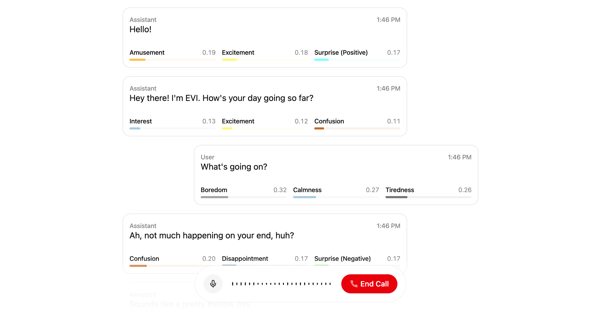

  
  <h1>EVI Next.js App Router Example</h1>

## Overview

This project features a sample implementation of Hume's [Empathic Voice Interface](https://hume.docs.buildwithfern.com/docs/empathic-voice-interface-evi/overview) using Hume's React SDK. Here, we have a simple EVI that uses the Next.js App Router.

## Project deployment

Click the button below to deploy this example project with Vercel:

Below are the steps to completing deployment:

1. Create a Git Repository for your project.
2. Provide the required environment variables. To get your API key and Client Secret key, log into the portal and visit the [API keys page](https://beta.hume.ai/settings/keys).
